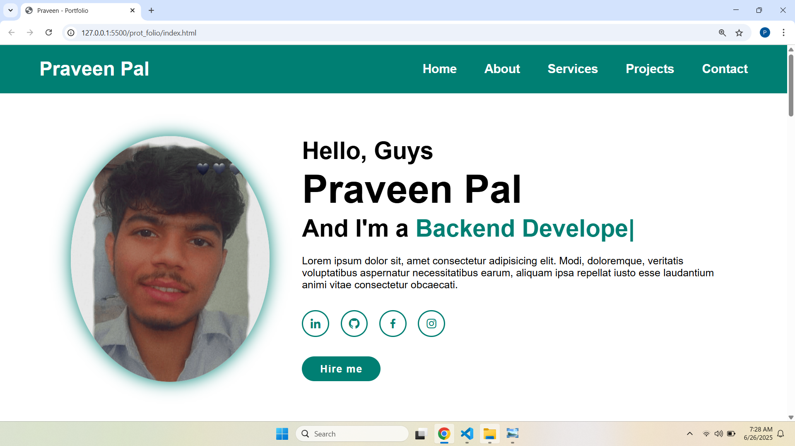

# 💼 Praveen Pal - Personal Portfolio

A clean, modern, and responsive **portfolio website** built using **HTML**, **CSS**, and **JavaScript**.  
This project showcases a personal brand, technical skills, and web development projects in a professional and visually appealing way.

## 🚀 Features

- Responsive layout for all screen sizes
- Smooth navigation with scroll behavior
- Animated text typing effect using [Typed.js](https://github.com/mattboldt/typed.js/)
- Mobile-friendly navbar with toggle menu
- Professional sections:
  - Home
  - About
  - Services
  - Projects
  - Contact
- Stylish icons via [Boxicons](https://boxicons.com/)

## 📸 Preview



## 🛠️ Tech Stack

- **HTML5**
- **CSS3**
- **JavaScript (ES6)**
- **Boxicons**
- **Typed.js**

## 📂 Folder Structure

 ```bash
📁 project-folder/
├── index.html
├── style.css
├── script.js
└── assets/
├── praveen.png
├── p-3.jpg
├── react.png
├── js.png
└── mangodb.png
```


## 📱 Responsive Design

Designed to adapt beautifully on all screen sizes — desktops, tablets, and mobile devices.

## 💡 Customization Tips

* Update your name, intro, and description in the `index.html`.
* Replace images in the `assets` folder with your own.
* Add your real social links in the social media section.

> Made with ❤️ by Praveen Pal


---
